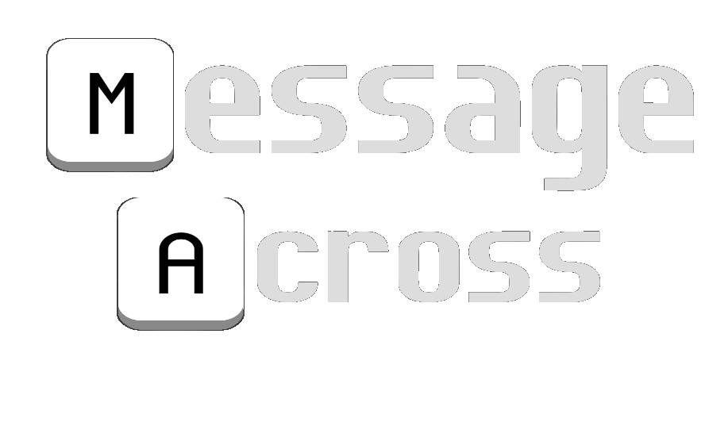
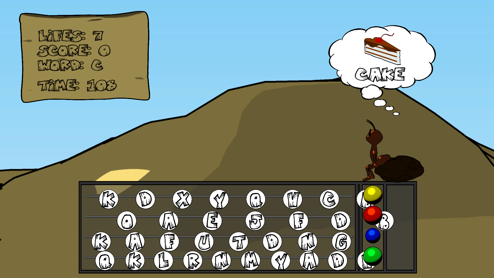

# crossAnt

Imagine you are an ant and you want to maintain the colony stable. To achieve your objective you have to serve the :crown: *Queen Ant* :crown: any type of food she likes. In order to get some food you got to use 4 colored buttons to press the letters of the requested food in an evergoing and challenge increasing rolling letter soup.  

The game was developed at Global Game Jam '18. The main theme to follow was *transmission*. Our game associates to such theme, as it is based on the communication (transmission) of a message between a *Helper Ant* and the *Queen Ant*.

## Controls:

- The configured keyboard controls are *Z,X,C,V* to press each of the four colored buttons;
- Xbox control is also supported. In such case the colors of the game buttons match the colors of the ones in the Xbox controller.

## Contributors:
- Elio Samuel Freitas - [@esgranados11](https://github.com/esgranados11)
- Miguel Marques - [@mikeloud](https://github.com/mikeloud)
- Samuel Gomes - [@SamGomes](https://github.com/SamGomes)

## Screenshot:

